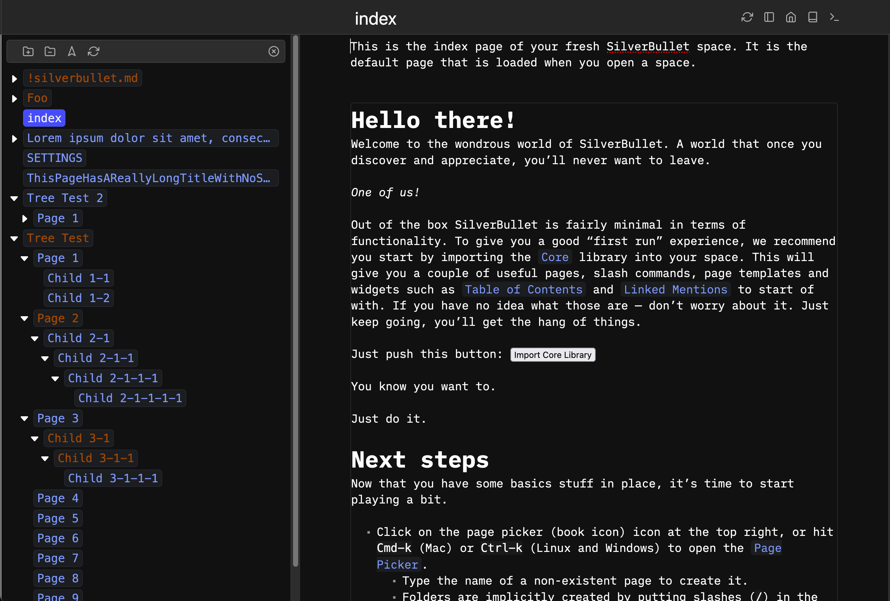
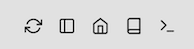

# SilverBullet TreeView plug

This plugs adds a tree view that allows you to navigate your SilverBullet pages Hierarchically.


<a href="screenshot.png"></a>
<a href="screenshot-dark.png"></a>

## Installation

Use the `Plugs: Add` command and enter the following URI:

`github:joekrill/silverbullet-treeview/treeview.plug.js`

_or_

Open (`cmd+k`) your `PLUGS` note in SilverBullet and add this plug to the list:

```yaml
- github:joekrill/silverbullet-treeview/treeview.plug.js
```

Then run the `Plugs: Update` command and off you go!

## Configuration

This plug can be configured using the `SETTINGS` page:

```yaml
treeview:
  # Determines where the panel is displayed:
  # - "lhs" - left hand side
  # - "rhs" - right hand side
  # - "bhs" - bottom
  # - "modal" - in a modal
  position: lhs 

  # Must be > 0. 
  # position = "lhs" | "rhs": determines the width of the panel.
  # position = "modal": sets the margin around the modal window. 
  # position = "bhs": No effect
  size: 1 
```

### Adding a top bar toggle icon



You can add add a button to the top bar that will toggle the tree view by adding 
the following to your `actionButtons` in your `SETTINGS` page:

```yaml
actionButtons:
- icon: sidebar
  command: "{[Tree View: Toggle]}"
  description: "Toggle Tree View"
```

## Build

To build this plug, make sure you have [SilverBullet installed](https://silverbullet.md/Install). Then, build the plug with:

```shell
deno task build
```

Or to watch for changes and rebuild automatically

```shell
deno task watch
```

Then, copy the resulting `.plug.js` file into your space's `_plug` folder. Or build and copy in one command:

```shell
deno task build && cp *.plug.js /my/space/_plug/
```

SilverBullet will automatically sync and load the new version of the plug (or speed up this process by running the {[Sync: Now]} command).

## Development

### `SortableTree`

The tree component used is Marc Anton Dahmen's [SortableTree](https://marcantondahmen.github.io/sortable-tree) component ([Github Repo](https://github.com/marcantondahmen/sortable-tree)).

Latest build files can be found here (replace them in `assets/sortable-tree` to upgrade): 

- https://unpkg.com/sortable-tree/dist/sortable-tree.js
- https://unpkg.com/sortable-tree/dist/sortable-tree.css